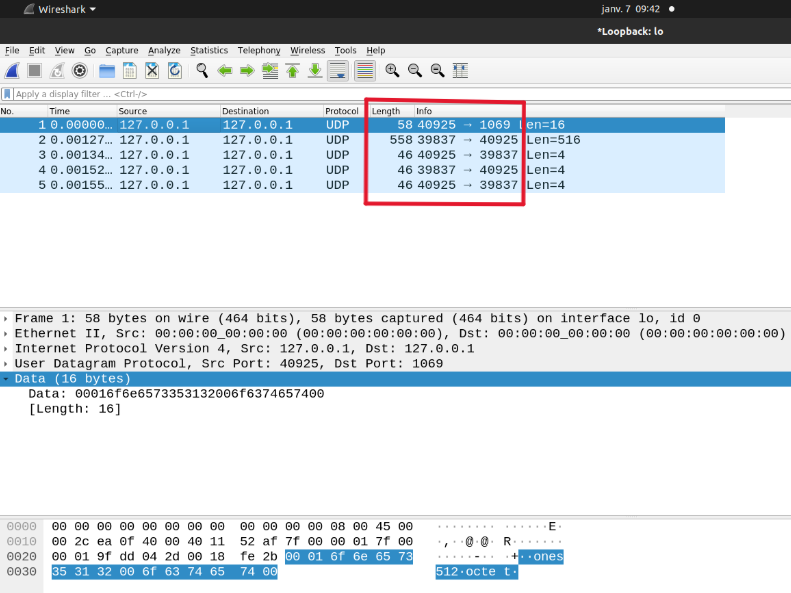

# TFTP Client Project

This repository contains the implementation of a TFTP (Trivial File Transfer Protocol) client developed as part of a practical assignment. Each step of the project corresponds to a specific question or challenge that we encountered and solved during the implementation. This work was done by **Khalid Zouhair** and **Fabien Marcellin**.

## Project Overview
The TFTP client is capable of:
- Uploading files to a server using the WRQ (Write Request) process.
- Downloading files from a server using the RRQ (Read Request) process.
- Handling retransmissions and dynamic port adjustments as required by the TFTP protocol.
- Debugging communication issues using Wireshark to inspect and validate packets.

## Step-by-Step Development

### **Question 1: Setting up the Environment**
The first step was to set up the TFTP server and client on the same machine for testing. We used Wireshark to monitor network traffic and verify that the server was correctly listening on the designated port (1069). The client was implemented to send basic WRQ and RRQ packets, confirming basic communication.

### **Question 2: Implementing File Upload (WRQ)**
In **puttftp.c**, we implemented the logic for uploading files to the server:
- The client sends a Write Request (WRQ) containing the file name and transfer mode (octet).
- After receiving an ACK for block 0, the client reads the file in 512-byte blocks and sends each block sequentially to the server.
- Each data block is followed by an ACK from the server, and the client resends blocks if the ACK is invalid or not received within the timeout period.
- Debugging involved validating WRQ packets and ACK responses using Wireshark to ensure proper sequencing.

### **Question 3: Implementing File Download (RRQ)**
In **gettftp.c**, we added support for downloading files from the server:
- The client sends a Read Request (RRQ) with the file name and transfer mode (octet).
- The server responds with data packets, each prefixed with a TFTP header.
- The client writes the received data to a file and sends ACKs for each block.
- This step included debugging issues with incomplete file transfers and ensuring proper handling of smaller final blocks.

### **Question 4: Solving the Dynamic Port Issue**
Initially, the client sent all packets to port 1069, even after receiving a response from the server. However, the TFTP protocol specifies that subsequent packets must use the port indicated in the server's response (ACK for WRQ or data for RRQ). To resolve this:
- We updated the code to dynamically adjust the destination port after receiving the first response from the server.
- Using Wireshark, we validated that the client correctly switched to the server's response port. This can be seen in the screenshots below:

  - **First WRQ Packet**: The client sends the WRQ to port 1069. This is visible in the first packet in Wireshark:
    

  - **Dynamic Port Update**: After the server's response, the client adjusts to the port specified in the server's ACK. Subsequent packets use this new port, as seen in the following packets:
    

### **Question 5: Debugging with Wireshark**
Wireshark was an invaluable tool throughout the project. It allowed us to:
- Inspect TFTP packets to verify formatting, such as opcodes, file names, and block numbers.
- Identify and resolve issues like sending to the wrong port or missing ACKs.
- Filter relevant traffic using `udp.port == 1069` to focus on TFTP packets.
- Validate retransmissions and ensure proper sequencing of data and ACK packets.

Made by Khalid Zouhair & Fabien Marcellin

07/01/2025
